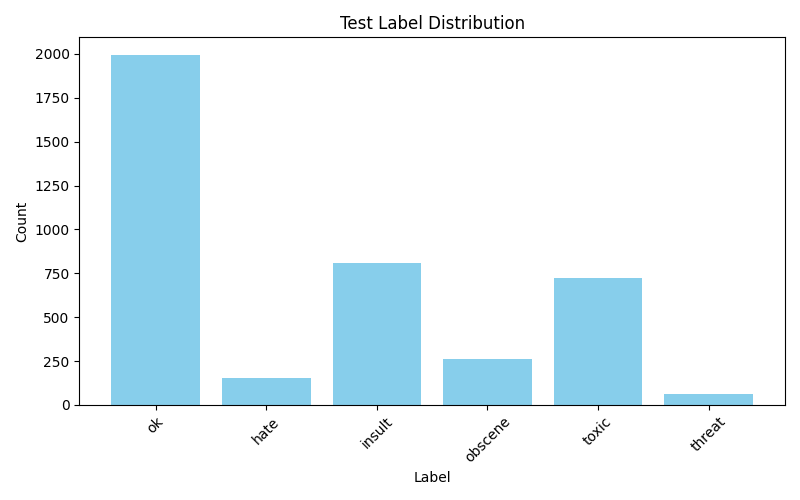

# Toxic_Language Naive Bayes
## Machine Learning Course Project
---
### Author: Naoya Kumakura
### Date: June 2025
---
This repository contains a Jupyter Notebook (ipynb file) for Offensive Message Classification.  
It focuses on multi-class / 2-class classification tasks using text data.

## Contents

- Data preprocessing (text cleaning, BoW/TF-IDF vectorization)
- Feature extraction using Bag of Words (BoW) and TF-IDF
- Classification using machine learning models such as Naive Bayes
- Calculation of evaluation metrics (accuracy, recall, F1 score, etc.)
- Implementation examples using scikit-learn and PyTorch

## Usage

1. Install the required libraries (e.g., `scikit-learn`, `torch`, `numpy`, etc.).
2. Open the Jupyter

## Label Distribution

## Index
